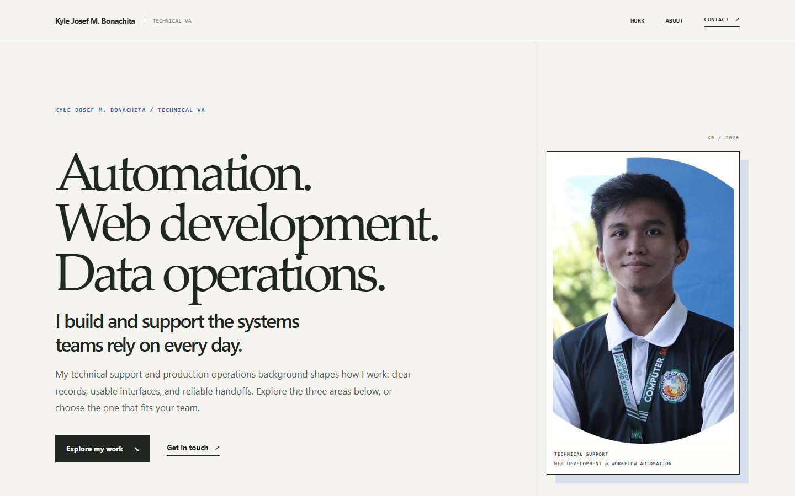

# Kyle Josef M. Bonachita — Technical VA Portfolio

A responsive portfolio of automation, web development, and data operations work.

## Explore the work

Scroll through the three chapters in order, or use the focus selector to view one area and its projects. The selector supports direct links such as `#automation`, `#web-development`, and `#data-operations`. All project content remains available when JavaScript is off.

- **Automation:** Appscripter, a local Google Apps Script backup dashboard and CLI; and a Power Automate reminder for a Microsoft Teams tech team.
- **Web development:** Device Custody Tracker, a responsive Apps Script inventory web app; plus Appscripter's browser dashboard.
- **Data operations:** Data Quality Lab, an interactive fictional CSV cleanup demo; plus the Device Custody Tracker's inventory record model.

The case studies distinguish built projects, a built workflow, and a portfolio demo. Example images and CSV data use placeholders or fictional records; internal production data and private links are excluded.

## Run locally

From this folder:

    python -m http.server 8000

Then open http://localhost:8000/ in a browser. The site uses plain HTML, CSS, and JavaScript, with no build step or package installation.

## Update details

Edit `site-config.js` to change the name, email, LinkedIn, GitHub, Upwork, or location displayed on the site. Case-study content is in `work/`; the interactive CSV demo is in `lab/`.

## Checks

The responsive layout, focus selector, deep links, keyboard focus, case-study pages, images, and CSV demo were checked in Chromium at desktop, tablet, and mobile widths.
